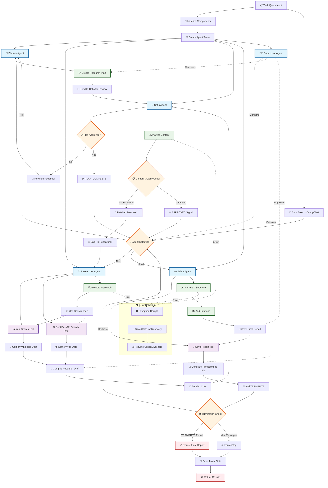

# 🤖 Multi-Agent Research Workflow

This diagram illustrates the orchestrated workflow of specialized AI agents working together to conduct high-quality research using AutoGen and LangChain tools.

## Workflow Overview

## Workflow Phases

### 🧭 **Phase 1: Planning**
- **Planner Agent** creates detailed research strategy
- **Critic Agent** reviews and provides feedback
- Iterative refinement until `PLAN_COMPLETE`

### 🔍 **Phase 2: Research**
- **Researcher Agent** executes approved plan
- Uses Wikipedia and DuckDuckGo search tools
- Compiles comprehensive research draft

### 🧪 **Phase 3: Quality Assurance**
- **Critic Agent** analyzes research for accuracy and completeness
- Provides detailed feedback or `APPROVED` signal
- Ensures source citations and logical structure

### ✍️ **Phase 4: Editorial**
- **Editor Agent** formats and structures content
- Adds proper citations and professional styling
- Saves final report with timestamp
- Signals `TERMINATE` for completion

### 👨‍💼 **Phase 5: Orchestration**
- **Supervisor Agent** provides oversight throughout
- **SelectorGroupChat** manages agent selection
- State management for recovery and debugging

## Key Features

- 🛡️ **Error Recovery**: Automatic state saving and resume capability
- 🔄 **Iterative Refinement**: Multiple review cycles ensure quality
- 📊 **Comprehensive Logging**: Full execution trail with structured logs
- 🎯 **Termination Safety**: Multiple termination conditions prevent infinite loops
- 🔧 **Tool Integration**: Seamless LangChain tool usage for data gathering